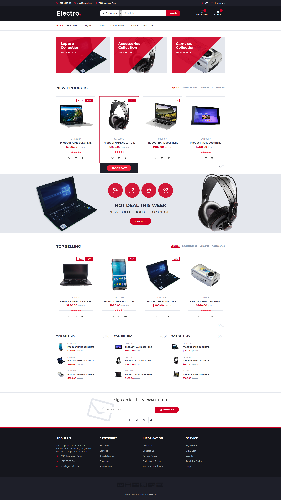
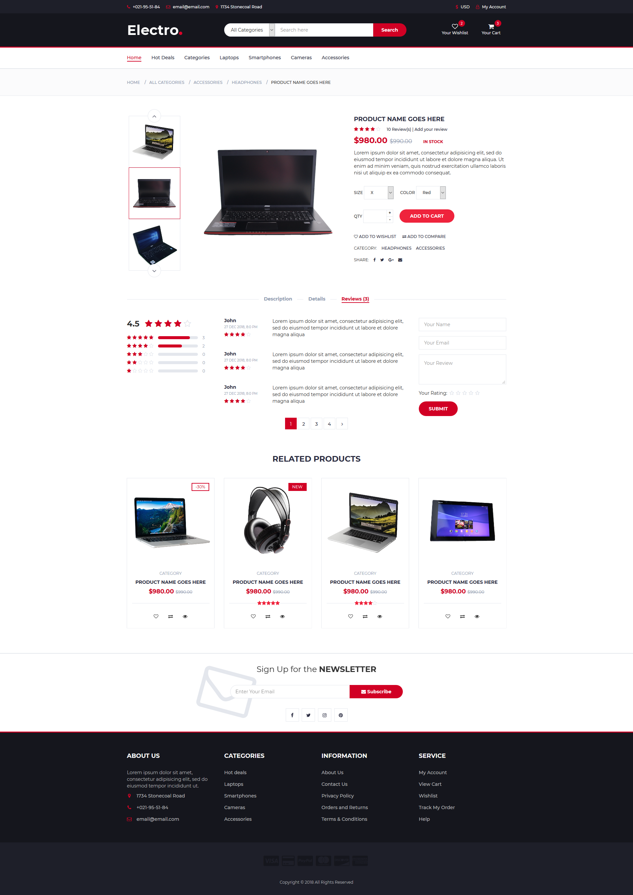
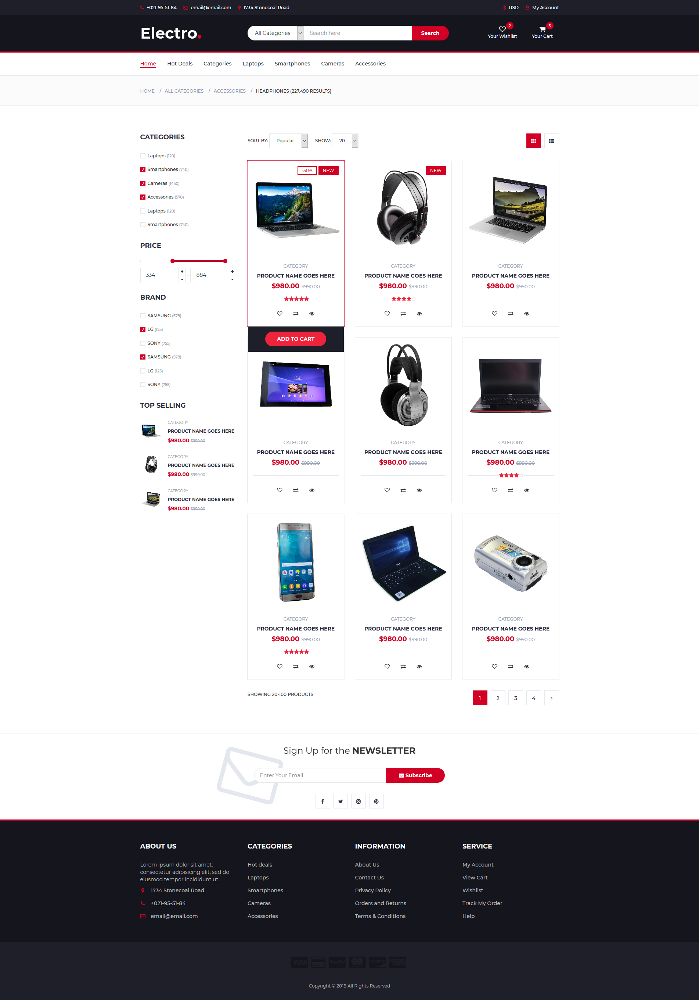
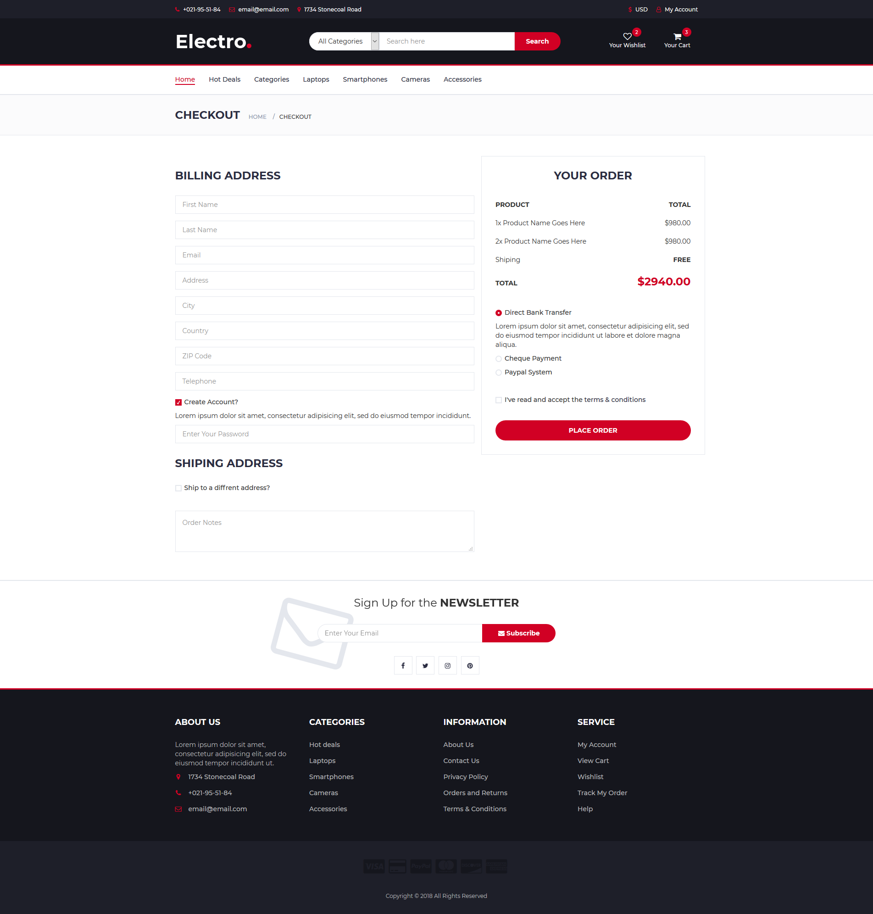
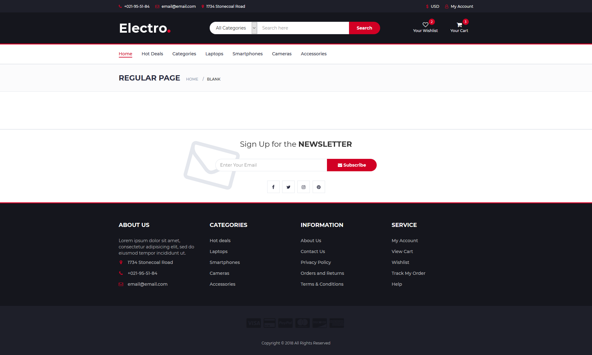

# Electro — E-Commerce Website

A beginner-friendly, static e-commerce website built as part of the **DEPI (Digital Egypt Pioneers Initiative)** program. The project showcases a multi-page electronics store with product categories, a shopping cart, user authentication forms, and more.

---

## Screenshots

| Home | Products | Store |
|------|----------|-------|
|  |  |  |

| Cart / Checkout | Regular Page |
|-----------------|--------------|
|  |  |

---

## Features

- **Home Page** – Landing page with site navigation and a quick link to the product catalogue.
- **Product Categories** – Dedicated pages for Laptops, Phones, Accessories, and Cameras.
- **Products Page** – Lists all categories with a search bar ready for integration.
- **Shopping Cart** – Cart page with placeholders ready for cart logic implementation.
- **Login & Sign Up** – User authentication forms (email/password).
- **About Page** – Team information and task distribution table.
- **Responsive Design** – Built with Bootstrap for mobile-first layouts.
- **Interactive UI** – Slick carousels, image zoom, price range slider (noUiSlider), and Font Awesome icons.

---

## Pages

| Page | File | Description |
|------|------|-------------|
| Home | `index.html` | Landing page |
| Products | `pages/products.html` | Category navigation + search |
| Laptops | `pages/laptops.html` | Laptop product listing |
| Phones | `pages/phones.html` | Phone product listing |
| Accessories | `pages/accessories.html` | Accessories product listing |
| Cameras | `pages/cameras.html` | Camera product listing |
| Cart | `pages/cart.html` | Shopping cart |
| Login | `pages/login.html` | User login form |
| Sign Up | `pages/signup.html` | User registration form |
| About | `pages/about.html` | Team tasks table |

---

## Tech Stack

| Technology | Purpose |
|------------|---------|
| HTML5 | Page structure |
| CSS3 | Styling |
| [Bootstrap 3](https://getbootstrap.com/docs/3.4/) | Responsive grid and UI components |
| [jQuery](https://jquery.com/) | DOM manipulation and event handling |
| [Slick Slider](https://kenwheeler.github.io/slick/) | Product carousels |
| [noUiSlider](https://refreshless.com/nouislider/) | Price range slider |
| [Font Awesome](https://fontawesome.com/) | Icons |
| [jQuery Zoom](https://www.jacklmoore.com/zoom/) | Product image zoom |

---

## Project Structure

```
E-Commerce-DEPI/
├── index.html              # Home page
├── pages/
│   ├── products.html       # Products catalogue
│   ├── laptops.html        # Laptops category
│   ├── phones.html         # Phones category
│   ├── accessories.html    # Accessories category
│   ├── cameras.html        # Cameras category
│   ├── cart.html           # Shopping cart
│   ├── login.html          # Login page
│   ├── signup.html         # Sign-up page
│   └── about.html          # About / team tasks
└── assets/
    ├── css/                # Stylesheets (Bootstrap, Font Awesome, custom)
    ├── js/                 # JavaScript files (jQuery, Bootstrap, page logic)
    ├── imges/              # Image assets
    ├── fonts/              # Font files
    └── screenshot/         # Project screenshots
```

---

## Getting Started

No build tools or server setup is required — this is a purely static website.

1. **Clone the repository**
   ```bash
   git clone https://github.com/TomasNageh/E-Commerce-DEPI.git
   cd E-Commerce-DEPI
   ```

2. **Open the site**
   - Open `index.html` directly in your browser, **or**
   - Serve it with any static file server, for example:
     ```bash
     # Python 3
     python -m http.server 8080
     ```
   Then navigate to `http://localhost:8080`.

---

## Team

| Name | Tasks |
|------|-------|
| **Thomas Nageh** | Home page, Laptops page, Product search |
| **Jolie Fayez** | Login page, Phones page |
| **Jana Khaled** | Sign Up page, Accessories page |
| **Omar Abdelaziz** | Cameras page, Cart page |

---

## License

This project was created for educational purposes as part of the DEPI program.
